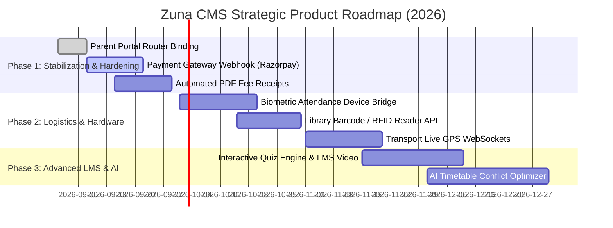

# Product Current Status & Pending Modules Report: Zuna CMS

**Document Version:** 3.0.0  
**Target Audience:** Product Managers, Engineering Leads, QA Teams, Institutional Executives  
**Date:** September 4, 2026  
**System Designation:** Zuna College Management System (CMS)  

---

## Executive Summary & System Health Scorecard

The **Zuna College Management System (CMS)** is currently in **Active Production / Staging Readiness (Release Candidate v2.4.0)**. The platform is connected to a live Railway PostgreSQL database managing **7 institutional colleges** with multi-tenant row-level security. 

Core workflows covering institutional onboarding, RBAC, dynamic academic structures, examination scheduling, HOD facility approval pipelines, student lifecycle, and universal pagination are **100% operational**.

```
+-------------------------------------------------------------------------+
|                        SYSTEM MATURITY SCORECARD                        |
|                                                                         |
|  [####################] 100% Core Multi-Tenant Architecture & Auth      |
|  [##################--]  90% College Admin Operational Modules          |
|  [#################---]  85% Student & Teacher Portals                  |
|  [#############-------]  65% Operational Logistics (Hostel/Transport)   |
|  [##########----------]  50% Advanced Integrations (Payment/LMS/Biometric|
|                                                                         |
|  OVERALL SYSTEM COMPLETION: ~82% Enterprise Ready                       |
+-------------------------------------------------------------------------+
```

---

## 1. Comprehensive Module Status Matrix

The following matrix categorizes all 37 backend modules and frontend interfaces:

| Module Identifier | Category | Backend Implementation | Frontend UI / Portal | Operational Status |
| :--- | :--- | :--- | :--- | :--- |
| **Auth & Security** | Core | JWT + Refresh Tokens + Tenant Resolver | `/login`, `/register`, `/forgot-password` | 🟢 **Fully Operational** |
| **Colleges & Onboarding** | Core | CRUD + Plan Tier Sync + Status Gates | `/super/colleges`, `/register-college` | 🟢 **Fully Operational** |
| **SuperAdmin Subscriptions** | Core | `PUT /api/v1/colleges/:id/subscription` | `/super/subscriptions` | 🟢 **Fully Operational** |
| **Roles & Permissions (RBAC)**| Core | Dynamic `RolePermission` matrix | `/admin/roles` | 🟢 **Fully Operational** |
| **Academic Structure** | Academics | Department, Course, Section APIs | `/admin/academic-structure` | 🟢 **Fully Operational** |
| **Student Lifecycle** | Academics | Profiles, Excel Upload, Filter Engine | `/admin/students`, `/student/register` | 🟢 **Fully Operational** |
| **HR & Faculty Management** | HR | Staff directory, HOD designation | `/admin/hr`, `/staff-setup` | 🟢 **Fully Operational** |
| **Timetable & Scheduling** | Academics | Conflict-aware timetable slots | `/admin/timetable`, Teacher schedule | 🟢 **Fully Operational** |
| **Examinations & Grading** | Academics | Dynamic department + Custom exam types | `/admin/exams`, Teacher grade entry | 🟢 **Fully Operational** |
| **Infrastructure & Facilities**| Operations| Physical assets + Booking Approval API | `/admin/infrastructure`, HOD portal | 🟢 **Fully Operational** |
| **In-App Notifications** | Core | `/api/v1/notifications` REST alerts | `NotificationDropdown.jsx` bell badge | 🟢 **Fully Operational** |
| **Admissions Management** | Academics | Applications & status pipeline | `/admin/admission` | 🟢 **Fully Operational** |
| **Universal Pagination** | UI Engine | Backend `take/skip` + Client `Pagination`| Standardized across all tables | 🟢 **Fully Operational** |
| **Fees & Invoicing** | Finance | `FeeStructure`, `Fee`, Ledgers | `/admin/fees`, `/student/fees` | 🟡 **Functional (Needs PG Hook)**|
| **Attendance Tracking** | Academics | Daily batch session logging | `/admin/attendance`, `/teacher/attendance`| 🟡 **Functional (Manual Entry)**|
| **Assignments & Homework** | Academics | CRUD + Submission attachments | `/student/assignments`, `/teacher/assign` | 🟡 **Functional (Basic Upload)**|
| **Library Management** | Operations | Catalog, book issue/return ledger | `/admin/library`, `/student/library` | 🟡 **Functional (No RFID/Barcode)**|
| **Hostel Management** | Operations | Block & room allotment | `/admin/hostel`, `/student/hostel` | 🟡 **Functional (Needs Meal Track)**|
| **Transport Management** | Operations | Routes, vehicles, stop management | `/admin/transport`, `/student/transport` | 🟡 **Functional (Needs Live GPS)** |
| **Notice Board** | Comm | Push announcements & role targeting | `/admin/notices`, Student noticeboard | 🟢 **Fully Operational** |
| **Complaints & Grievances** | Support | Ticket raising, priority & resolution | `/admin/complaints`, `/student/complaint` | 🟢 **Fully Operational** |
| **Placements & Training** | Career | Job postings, eligibility, drives | `/admin/placements`, Student placements | 🟢 **Fully Operational** |
| **Payroll & Compensation** | HR/Finance | Salary structures, payslip generation | `/admin/payroll`, Teacher payroll view | 🟡 **Functional (Needs Tax Calc)**|
| **Inventory & Asset Store** | Operations | Stock levels, categories, audit logs | `/admin/inventory` | 🟡 **Functional (Needs POS)** |
| **Dynamic Module Builder** | Extensibility| `CustomEntity`, `CustomFieldDef` APIs | `/admin/builder`, `/admin/dynamic/:slug` | 🟡 **Functional (UI Ready)** |
| **Student Portal** | Portal | Unified student dashboard (14 tabs) | `/student/*` | 🟢 **Fully Operational** |
| **Teacher / HOD Portal** | Portal | Facility requests, grading, schedule | `/teacher/*` | 🟢 **Fully Operational** |
| **Parent Portal** | Portal | Student progress & fee views | Views exist in `/pages/parent/` | 🔴 **Route Registration Needed**|
| **Learning Management (LMS)**| E-Learning | Mocked endpoints in `stubs.js` | `/admin/lms`, `/student/lms` (Basic UI) | 🔴 **Pending Full Implementation**|
| **Payment Gateway Webhooks** | Finance | Schema ready (`PaymentTransaction`) | Manual receipt logging active | 🔴 **Pending Razorpay/Stripe API**|
| **Live Biometric Hardware Sync**| Hardware | Stored via standard attendance | Manual batch marking active | 🔴 **Pending Device Bridge / SDK**|

---

## 2. Granular Analysis by User Portals

### 2.1 SuperAdmin Portal (`/super/*`)
* **Status:** 🟢 **100% Operational**
* **Capabilities:** Global college directory, manual & self-service college approval, plan management (Starter, Professional, Enterprise), dynamic module toggle per tenant, global email templates, and platform telemetry.

### 2.2 College Administrator Portal (`/admin/*`)
* **Status:** 🟢 **95% Operational**
* **Capabilities:** Complete governance over Departments, Courses, Sections, Staff, Students, Timetables, Custom Exam Types, Infrastructure Registry, Notice Boards, and Role-Based Permissions.

### 2.3 Faculty & Department HOD Portal (`/teacher/*`)
* **Status:** 🟢 **90% Operational**
* **Capabilities:** 
  * **HOD:** Direct facility reservation with custom AV/equipment requirements; real-time admin review alerts.
  * **Teachers:** Daily batch student attendance logging, assignment publishing, marks entry, timesheet tracking, and personal schedule views.

### 2.4 Student Portal (`/student/*`)
* **Status:** 🟢 **90% Operational**
* **Capabilities:** 14 dedicated tabs covering Timetable, Attendance percentages, Exam schedules & results, Fee balances & invoices, Course syllabi, Hostel room details, Transport route information, Notice board, and Grievance redressal.

### 2.5 Parent Portal (`/pages/parent/*`)
* **Status:** 🟡 **Components Built, Needs Router Binding**
* **Capabilities:** Standalone views (`ParentDashboard.jsx`, `ParentAttendance.jsx`, `ParentGrades.jsx`, `ParentHostel.jsx`, `ParentTransport.jsx`, `ParentComplaints.jsx`) are implemented but require explicit route binding in `App.jsx` under `/parent/*`.

---

## 3. High-Priority Pending Modules & Engineering Gaps

```
+-------------------------------------------------------------------------+
|                  HIGH-PRIORITY TECHNICAL ENHANCEMENTS                   |
|                                                                         |
|  1. PAYMENT GATEWAY (Razorpay / Stripe Webhook Integration)            |
|  2. PARENT ROUTING (Mount /parent/* in App.jsx & role redirect)         |
|  3. ADVANCED LMS (Video player, SCORM courseware & quiz auto-grading)   |
|  4. BIOMETRIC HARDWARE (ZKTeco / Essl biometric push API bridge)        |
|  5. LIVE FLEET GPS (WebSockets / Leaflet real-time bus tracking)        |
|  6. LIBRARY BARCODE (Client-side barcode/RFID scanner input reader)     |
+-------------------------------------------------------------------------+
```

### Gap 1: Automated Payment Gateway Integration (Razorpay / Stripe / PayU)
* **Current State:** Admins and students record transactions manually in `PaymentTransaction` table.
* **Pending Action:** Implement webhook handlers (`/api/v1/fees/webhook`) to handle instant invoice reconciliation, signature verification, and automated digital PDF receipt generation.

### Gap 2: Mount Parent Portal Routes in `App.jsx`
* **Current State:** Frontend component files exist in `Frontend/src/pages/parent/` but are omitted from `App.jsx`.
* **Pending Action:** Add `<Route path="/parent/*" element={<ProtectedRoute allowedRoles={['parent']}><ParentLayout /></ProtectedRoute>} />` and update `DashboardRedirect.jsx`.

### Gap 3: Full-Featured LMS Video & Quiz Engine
* **Current State:** Course materials allow static PDF syllabus links.
* **Pending Action:** Implement interactive video lessons, timed quiz engines with automated grading, and student progress percentage trackers.

### Gap 4: Biometric Attendance IoT Hardware Connector
* **Current State:** Attendance is marked manually via the teacher and admin web portals.
* **Pending Action:** Build a standardized REST webhook gateway (`POST /api/v1/attendance/biometric-sync`) compatible with biometric devices (ZKTeco, eSSL, Anviz) to automatically register student and staff punches.

### Gap 5: Real-Time Transport GPS Tracking
* **Current State:** Static bus routes, vehicle details, and stops are logged.
* **Pending Action:** Integrate driver mobile location streaming via WebSockets/MQTT with interactive Leaflet/Google Maps tracking in the student and parent apps.

### Gap 6: Automated Library Barcode & RFID Reader Integration
* **Current State:** Library items are cataloged with ISBN and title with manual search.
* **Pending Action:** Support instant camera/USB barcode scanning on check-out and check-in to automate book issue and return ledgers.

---

## 4. Strategic Product Roadmap & Milestones



### Phase 1: Immediate Stabilization (Next 2-4 Weeks)
* Mount and verify `/parent/*` routes in `App.jsx`.
* Integrate Razorpay / Stripe payment gateway webhooks for instant tuition fee settlements.
* Enable automated PDF invoice generation with downloadable receipts.

### Phase 2: Logistics & Hardware Integration (Month 2)
* Release biometric hardware sync API (`/api/v1/attendance/biometric-sync`).
* Implement USB/Camera barcode scanner in `/admin/library`.
* Build live driver GPS coordinates ingestion pipeline for college buses.

### Phase 3: Advanced Academic AI & LMS (Month 3-4)
* Launch interactive LMS with SCORM packages, quiz generation, and course certificates.
* Implement AI-driven automated Timetable Generator with constraint satisfaction (faculty availability, room capacity, lab equipment).

---

## 5. Summary & Action Plan for Development Team

The Zuna platform has achieved a stable, high-performance foundation with modern UI/UX and a clean multi-tenant backend architecture. By executing the prioritized roadmap outlined above, the development team can seamlessly transition the product from its current **82% Enterprise Ready** baseline to a complete, best-in-class market leader across the higher education sector.
