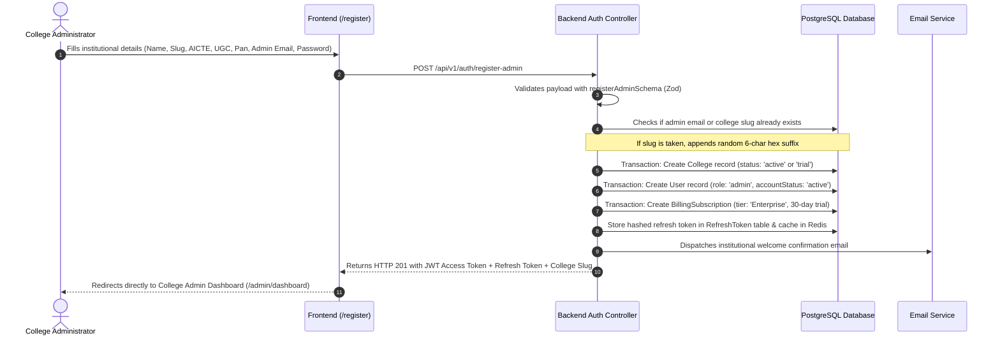
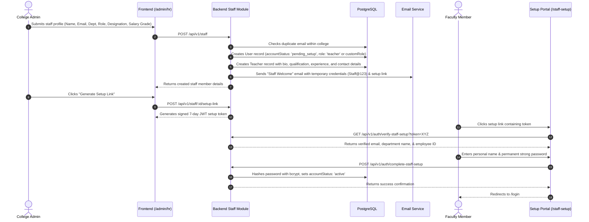
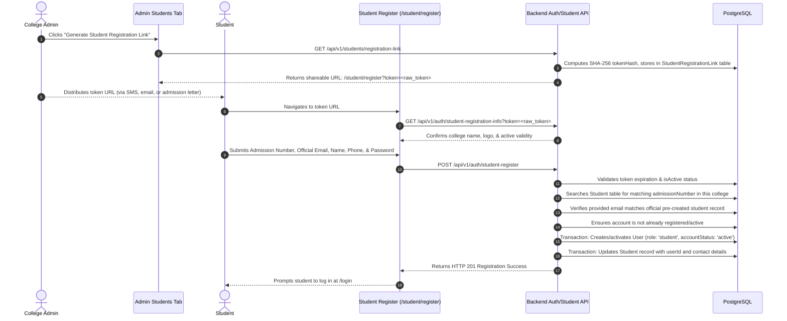
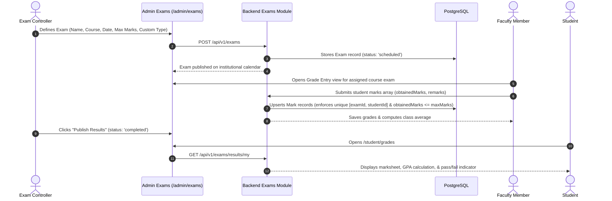
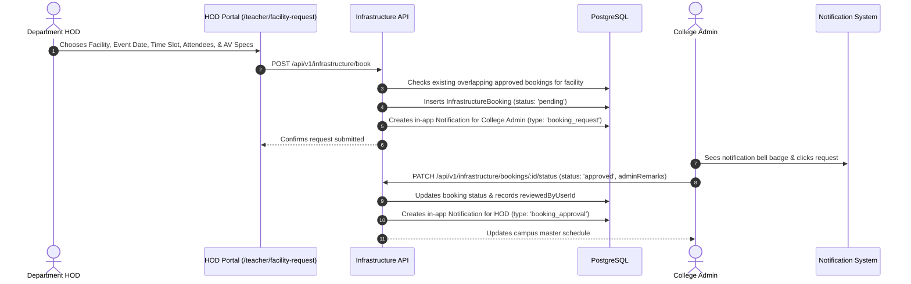
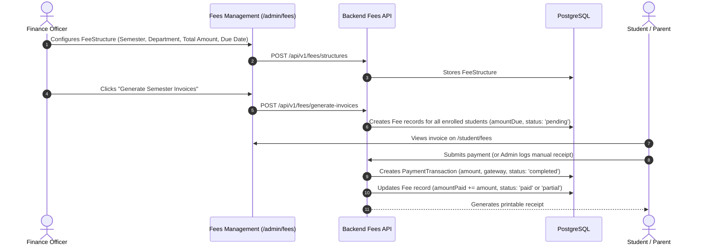

# Zuna College Management System (CMS) — Complete Product & Module Workflow Manual

**Document Version:** 1.0.0  
**Target Audience:** Product Managers, System Architects, Full-Stack Developers, QA Teams, Institutional Administrators  
**System Designation:** Zuna Multi-Tenant Campus Operating System  
**Date:** September 2026  

---

## Executive Overview & Architecture Foundation

The **Zuna College Management System** is an enterprise-grade, multi-tenant educational ERP designed to manage the end-to-end lifecycle of higher education institutions (Universities, Autonomous Colleges, and Affiliated Institutes).

```
+----------------------------------------------------------------------------------------------------+
|                                    PLATFORM ACTORS & ACCESS TIERS                                  |
+----------------------------------------------------------------------------------------------------+
|  1. SuperAdmin       : Global SaaS operator managing college subscriptions, plans, & global health |
|  2. College Admin    : Institutional owner managing academic structure, HR, fees, and operations   |
|  3. Department HOD   : Academic department lead approving facility bookings & monitoring faculty   |
|  4. Faculty/Teacher  : Academic staff managing attendance, marks, assignments, and timetables      |
|  5. Student          : Enrolled learner accessing schedule, fees, grades, hostel, & complaints     |
|  6. Parent           : Guardian tracking attendance, academic records, and fee balances            |
+----------------------------------------------------------------------------------------------------+
```

### Multi-Tenant Architecture & Data Security
* **Tenant Isolation:** Every institution is provisioned as a distinct `College` record with a unique slug (e.g. `oxford-inst`). All domain entities (`User`, `Student`, `Teacher`, `Course`, `Fee`, etc.) strictly enforce multi-tenant row-level security via the `collegeId` foreign key and backend tenant resolver middleware.
* **Authentication & Session Tokens:** 
  * Access tokens: Signed JWTs containing `userId`, `collegeId`, and `role`, expiring in 15 minutes.
  * Refresh tokens: Cryptographically secure 7-day tokens hashed via SHA-256 and stored in both PostgreSQL (`RefreshToken` table) and Redis for high-throughput revocation checks.
  * Zero Account Enumeration: Generic authentication failure messages prevent credential harvesting.

---

## Complete Module-by-Module Workflows

```
====================================================================================================
CHRONOLOGICAL ONBOARDING & OPERATIONAL PROGRESSION
====================================================================================================
1. School/College Registration  --> 2. SuperAdmin Approval & Plan Assignment
3. Role-Based Access Control    --> 4. Academic Structure Setup (Depts, Courses, Sections)
5. HR & Staff Registration      --> 6. Admissions & Student Onboarding (Links / Bulk Import)
7. Parent Onboarding & Linkage  --> 8. Class Scheduling & Conflict-Free Timetable
9. Daily Attendance Operations  --> 10. Assignments & Homework Delivery
11. Examinations & Grading      --> 12. Infrastructure & HOD Facility Booking
13. Library Book Management     --> 14. Hostel & Room Allocation
15. Transport Fleet Management  --> 16. Fee Structures, Invoicing & Billing
17. Staff Payroll & Payslips    --> 18. Store Inventory & Movement Audits
19. Campus Notices & Broadcasts --> 20. Helpdesk & Grievance Redressal
21. Career Placements & Drives  --> 22. Dynamic No-Code Module Builder
23. System Settings & Mailings
====================================================================================================
```

---

### Module 1: School / College Registration & Onboarding

#### 1.1 Purpose & Use Case
Allows new educational institutions to register themselves onto the Zuna platform, establish institutional credentials, configure regulatory compliance codes (AICTE, UGC, NAAC), and automatically provision their administrative workspace.

#### 1.2 Key Actors
* **Institution Founder / College Administrator**
* **Zuna SuperAdmin** (Platform Reviewer)

#### 1.3 Step-by-Step Workflow & Business Logic


#### 1.4 Database Entities Involved
* `College`: `id`, `name`, `slug`, `aicteNumber`, `aicteCode`, `ugcCode`, `affiliationCode`, `affiliationType`, `status`, `pan`, `tan`, `logoUrl`.
* `User`: `id`, `collegeId`, `email`, `passwordHash`, `role: 'admin'`, `accountStatus: 'active'`.
* `BillingSubscription`: `id`, `collegeId`, `planTier`, `maxStudents`, `trialExpiresAt`.

#### 1.5 API & UI Endpoints
* **Frontend Route:** [`/register`](file:///c:/College-Management-System-official/Frontend/src/pages/auth/Register.jsx)
* **Backend Endpoint:** `POST /api/v1/auth/register-admin`

---

### Module 2: SuperAdmin Governance & Subscription Management

#### 2.1 Purpose & Use Case
Provides platform owners with overarching authority to inspect registered institutions, approve or reject institutional tenants, manage subscription plans, toggle allowed system modules per tier, and track platform-wide telemetry.

#### 2.2 Key Actors
* **Platform SuperAdmin** (`role: 'superadmin'`)

#### 2.3 Step-by-Step Workflow & Business Logic
1. **Tenant Directory Review:** SuperAdmin logs in at `/login` with global credentials and accesses `/super/colleges`.
2. **Approval / Rejection Pipeline:** 
   * If a college registers in a pending state, SuperAdmin reviews accreditation and documents.
   * `PATCH /api/v1/colleges/:id/status` updates status to `active` or `rejected`.
   * If rejected, all users belonging to that college are locked out immediately via the JWT auth middleware check (`user.college.status === 'rejected'`).
3. **Subscription Tier Configuration:**
   * SuperAdmin navigates to `/super/subscriptions` to define tier limits (`Starter`, `Professional`, `Enterprise`) specifying max students, storage limit, price, and active modules list.
   * `PUT /api/v1/colleges/:id/subscription` updates college limits and allowed feature sets.

#### 2.4 Database Entities Involved
* `College`, `BillingSubscription`, `SubscriptionPlan`, `PlatformTicket`

#### 2.5 API & UI Endpoints
* **Frontend Routes:** `/super/colleges`, `/super/subscriptions`, `/super/dashboard`
* **Backend Endpoints:** `GET /api/v1/colleges`, `PATCH /api/v1/colleges/:id/status`, `PUT /api/v1/colleges/:id/subscription`, `GET/POST /api/v1/subscriptions/plans`

---

### Module 3: Role-Based Access Control (RBAC) & Permissions

#### 3.1 Purpose & Use Case
Enables institutions to define granular access control policies. In addition to built-in system roles, colleges can construct custom roles (e.g. "Lab Assistant", "Accounts Clerk", "Placement Officer") and assign exact Create, Read, Update, and Delete permissions across all 37 application modules.

#### 3.2 Key Actors
* **College Administrator**
* **Custom Role Users**

#### 3.3 Step-by-Step Workflow & Business Logic
1. **Permission Matrix Initialization:** The system maintains 37 pre-seeded `Module` records in the database.
2. **Custom Role Creation:** Admin opens `/admin/roles` and clicks **"Add Custom Role"**.
3. **Permission Configuration:** Admin selects a matrix of CRUD checkboxes:
   * `canCreate`, `canRead`, `canUpdate`, `canDelete` for each module.
4. **Persistence:** `POST /api/v1/roles` creates the `Role` and associated `RolePermission` link records under that `collegeId`.
5. **Staff Association:** When adding or editing staff members, the admin assigns this `customRoleId`.
6. **Enforcement:** On every protected API call, the permission middleware inspects `req.user.customRole.permissions` against the target module and required verb.

#### 3.4 Database Entities Involved
* `Role`: `id`, `name`, `collegeId`, `isSystemRole`.
* `Module`: `id`, `key`, `label`.
* `RolePermission`: `id`, `roleId`, `moduleId`, `canCreate`, `canRead`, `canUpdate`, `canDelete`.

#### 3.5 API & UI Endpoints
* **Frontend Route:** `/admin/roles`
* **Backend Endpoints:** `GET /api/v1/roles`, `POST /api/v1/roles`, `PUT /api/v1/roles/:id`, `DELETE /api/v1/roles/:id`

---

### Module 4: Academic Structure Setup (Departments, Courses & Sections)

#### 4.1 Purpose & Use Case
Constructs the foundational academic hierarchy of the institution. Must be configured prior to onboarding faculty and students so they can be associated with appropriate academic units.

#### 4.2 Key Actors
* **College Administrator**

#### 4.3 Step-by-Step Workflow & Business Logic
```
+-------------------------------------------------------------+
|                     ACADEMIC HIERARCHY                      |
|                                                             |
|   College                                                   |
|     └── Department (e.g., Computer Science & Engineering)  |
|           └── Course (e.g., B.Tech CSE - 8 Semesters)       |
|                 └── Section (e.g., Section A, Capacity: 60) |
+-------------------------------------------------------------+
```
1. **Department Setup:** 
   * Admin navigates to `/admin/academic-structure`.
   * Enters Department Name (e.g. "Mechanical Engineering") and Code (e.g. "MECH").
   * Option to leave HOD blank initially or designate an existing staff member.
2. **Course Creation:**
   * Under a selected Department, Admin creates Courses specifying Name, Code, Number of Semesters, Credit Hours, and optional Syllabus URL.
3. **Section Creation:**
   * Under a Course, Admin provisions Sections (e.g., "Section A", "Section B") with maximum student seating capacity.
4. **Validation:** Section capacities enforce strict enrolment caps during subsequent student admission and allocation.

#### 4.4 Database Entities Involved
* `Department`: `id`, `collegeId`, `name`, `code`, `hodUserId`, `customFields`.
* `Course`: `id`, `collegeId`, `departmentId`, `name`, `code`, `semester`, `credits`, `syllabusUrl`.
* `Section`: `id`, `collegeId`, `courseId`, `name`, `capacity`.

#### 4.5 API & UI Endpoints
* **Frontend Route:** `/admin/academic-structure`
* **Backend Endpoints:** 
  * `GET/POST/PUT/DELETE /api/v1/departments`
  * `GET/POST/PUT/DELETE /api/v1/courses`
  * `GET/POST/PUT/DELETE /api/v1/sections`

---

### Module 5: HR & Staff / Faculty Registration & Setup

#### 5.1 Purpose & Use Case
Manages the institutional faculty and non-teaching workforce, assigns academic departments, designates Heads of Department (HOD), handles onboarding invitations, and allows staff to configure their credentials securely.

#### 5.2 Key Actors
* **College Administrator**
* **Faculty / Staff Member**
* **Department HOD**

#### 5.3 Step-by-Step Workflow & Business Logic


4. **HOD Designation:** Admin can update a Department's `hodUserId` to point to a senior Teacher's User ID. This unlocks HOD privileges (e.g. reviewing facility requests).

#### 5.4 Database Entities Involved
* `User`: `id`, `collegeId`, `email`, `role`, `customRoleId`, `accountStatus: 'pending_setup' -> 'active'`.
* `Teacher`: `id`, `userId`, `collegeId`, `departmentId`, `designation`, `joiningDate`, `salaryGrade`, `mobileNumber`, `aadhaarNumber`, `panNumber`, `bloodGroup`, `emergencyContactName`, `emergencyContactNumber`.
* `Department`: `hodUserId`.

#### 5.5 API & UI Endpoints
* **Frontend Routes:** 
  * Admin HR: [`/admin/hr`](file:///c:/College-Management-System-official/Frontend/src/pages/admin/hr/)
  * Staff Self-Setup: [`/staff-setup`](file:///c:/College-Management-System-official/Frontend/src/pages/auth/StaffSetup.jsx)
* **Backend Endpoints:**
  * `GET/POST /api/v1/staff`
  * `PUT/DELETE /api/v1/staff/:id`
  * `POST /api/v1/staff/:id/setup-link`
  * `GET /api/v1/auth/verify-staff-setup`
  * `POST /api/v1/auth/complete-staff-setup`

---

### Module 6: Student Admissions & Onboarding Pipeline

#### 6.1 Purpose & Use Case
Supports multiple onboarding channels for learners: prospective applicant inquiry, qualification cutoff evaluation, seat allocation hold, bulk Excel spreadsheet ingestion, and self-registration links with pre-assigned Admission Numbers.

#### 6.2 Key Actors
* **Prospective Student / Applicant**
* **Admissions Officer / College Admin**
* **Admitted Student**

#### 6.3 Step-by-Step Workflow & Business Logic

##### Pathway A: Admissions Desk & Seat Hold Pipeline
1. **Inquiry Submission:** Applicant or front desk submits application (`applicantName`, `email`, `phone`, `courseId`, `marksheetDetails`, `residenceType`) via `POST /api/v1/admissions`. Status starts as `Pending`.
2. **Cutoff Review:** The system evaluates `marksheetDetails` against eligibility cutoffs (`cutoffCheckResult: { passed: true }`).
3. **Seat Allocation:** Admin clicks **"Allot Seat"**. The backend updates status to `Approved` and sets a 72-hour seat reservation window (`seatHoldExpiresAt = now + 3 days`).
4. **Conversion:** Once registration fees are paid, the applicant is converted into an enrolled `Student` record.

##### Pathway B: Direct Self-Registration via Secure Token Link


##### Pathway C: Bulk Excel Data Import
1. Admin downloads standardized Excel template (`CMS File Format`).
2. Uploads filled spreadsheet containing Admission Numbers, Student Names, Department, Roll No, DOB, Aadhaar, Parent Mobile, Blood Group, Hostel/Transport requirements.
3. Backend (`POST /api/v1/students/bulk-import`) processes rows within a transactional loop, creates student user accounts with default password (`Student@123`), and populates `Student` table.

#### 6.4 Database Entities Involved
* `Admission`: `id`, `collegeId`, `applicantName`, `departmentId`, `marksheetDetails`, `status`, `seatHoldExpiresAt`, `residenceType`.
* `StudentRegistrationLink`: `id`, `collegeId`, `tokenHash`, `isActive`, `expiresAt`.
* `Student`: `id`, `userId`, `collegeId`, `departmentId`, `courseId`, `sectionId`, `admissionNumber`, `rollNumber`, `batchYear`, `bloodGroup`, `residenceType`, `fatherName`, `motherName`, `parentMobile`, `studentMobile`, `emailId`, `aadhaarNumber`.
* `Enrollment`: `id`, `collegeId`, `studentId`, `courseId`, `semester`, `status`.

#### 6.5 API & UI Endpoints
* **Frontend Routes:**
  * Admissions Portal: [`/admin/admission`](file:///c:/College-Management-System-official/Frontend/src/pages/admin/admission/)
  * Students Directory & Link Manager: [`/admin/students`](file:///c:/College-Management-System-official/Frontend/src/pages/admin/students/)
  * Student Registration Page: [`/student/register`](file:///c:/College-Management-System-official/Frontend/src/pages/auth/StudentRegister.jsx)
* **Backend Endpoints:**
  * `GET/POST /api/v1/admissions`
  * `POST /api/v1/admissions/allot-seat`
  * `GET/POST /api/v1/students`
  * `POST /api/v1/students/bulk-import`
  * `GET /api/v1/students/registration-link`
  * `POST /api/v1/students/regenerate-registration-link`
  * `GET /api/v1/auth/student-registration-info`
  * `POST /api/v1/auth/student-register`

---

### Module 7: Parent Onboarding & Student Linkage

#### 7.1 Purpose & Use Case
Permits parents and guardians to access real-time visibility into their ward's academic trajectory, attendance percentages, fee dues, hostel welfare, and disciplinary records.

#### 7.2 Key Actors
* **Parent / Guardian** (`role: 'parent'`)
* **College Administrator**

#### 7.3 Step-by-Step Workflow & Business Logic
1. **Account Creation:** Admin creates or imports parent profile matching student's emergency mobile/email records.
2. **Relationship Binding:** The database establishes a record in the `ParentStudentLink` junction table linking `parentId` to `studentId`. A single parent account can be linked to multiple children enrolled in the same institution.
3. **Portal Experience:** Upon authentication, the parent portal queries linked children and presents a ward selector to switch between siblings.

#### 7.4 Database Entities Involved
* `Parent`: `id`, `collegeId`, `userId`.
* `ParentStudentLink`: `parentId`, `studentId`.
* `User`: `role: 'parent'`.

#### 7.5 API & UI Endpoints
* **Frontend Routes:** `/parent/dashboard`, `/parent/attendance`, `/parent/grades`, `/parent/fees`
* **Backend Endpoints:** `GET /api/v1/parent/students`, `GET /api/v1/parent/overview`

---

### Module 8: Timetable & Class Scheduling

#### 8.1 Purpose & Use Case
Enables department coordinators and administrators to construct conflict-free weekly timetables. Prevents double-booking of physical classrooms and teacher schedules at the database level.

#### 8.2 Key Actors
* **College Admin / Department Coordinator**
* **Teachers & Students** (Viewers)

#### 8.3 Step-by-Step Workflow & Business Logic
1. **Grid Selection:** Admin selects Department, Course, Section, and Day of the Week (1 to 7).
2. **Slot Definition:** Admin picks Start Time, End Time, Course Subject, Assigned Teacher, and Classroom / Lab number.
3. **Collision Verification:** The database enforces two composite unique constraints:
   * `@@unique([collegeId, dayOfWeek, startTime, room])`: Guarantees no two classes share the same room at the same time.
   * `@@unique([collegeId, dayOfWeek, startTime, teacherId])`: Guarantees no teacher is assigned two lectures simultaneously.
4. **Publishing & Feed:** Once saved, timetable slots instantly reflect in the Teacher's daily schedule view (`/teacher/schedule`) and Student's class timeline (`/student/timetable`).

#### 8.4 Database Entities Involved
* `TimetableSlot`: `id`, `collegeId`, `departmentId`, `sectionId`, `courseId`, `teacherId`, `dayOfWeek`, `startTime`, `endTime`, `room`.

#### 8.5 API & UI Endpoints
* **Frontend Routes:** `/admin/timetable`, `/teacher/schedule`, `/student/timetable`
* **Backend Endpoints:** `GET/POST /api/v1/timetable`, `DELETE /api/v1/timetable/:id`

---

### Module 9: Daily Attendance Operations

#### 9.1 Purpose & Use Case
Provides rapid batch-attendance marking for class sessions. Tracks present, absent, and late entries, enforces submission time windows, and calculates student attendance percentages.

#### 9.2 Key Actors
* **Subject Teacher / Faculty**
* **College Administrator**
* **Students & Parents** (Viewers)

#### 9.3 Step-by-Step Workflow & Business Logic
1. **Session Selection:** Faculty opens `/teacher/attendance`, selects Course, Section, and Date.
2. **Student Roster Fetch:** Frontend displays the section's enrolled student roster defaulting to "Present".
3. **Toggling Status:** Teacher toggles absentees and late entries with single clicks.
4. **Submission Window:** The backend validates whether the submission occurs within the permissible institutional time window (`submittedWithinWindow: true`).
5. **Analytics Calculation:** 
   $$\text{Attendance \%} = \left(\frac{\text{Sessions Attended}}{\text{Total Sessions Held}}\right) \times 100$$
   If attendance falls below 75%, visual warning badges are displayed on the Student and Parent dashboards.

#### 9.4 Database Entities Involved
* `Attendance`: `id`, `collegeId`, `courseId`, `studentId`, `teacherId`, `date`, `status`, `isLateEntry`, `markedAt`, `submittedWithinWindow`.

#### 9.5 API & UI Endpoints
* **Frontend Routes:** `/admin/attendance`, `/teacher/attendance`, `/student/attendance`
* **Backend Endpoints:** `GET/POST /api/v1/attendance`, `GET /api/v1/attendance/summary`

---

### Module 10: Assignments & Coursework Delivery

#### 10.1 Purpose & Use Case
Facilitates homework distribution, digital file submissions, deadline management, and qualitative grading feedback between teachers and students.

#### 10.2 Key Actors
* **Teacher** (Author & Grader)
* **Student** (Submitter)

#### 10.3 Step-by-Step Workflow & Business Logic
1. **Assignment Publication:** Teacher creates assignment specifying Course, Title, Detailed Instructions, Due Date, and optional PDF attachment link (`POST /api/v1/assignments`).
2. **Student Notification:** Enrolled students receive an assignment alert on their dashboard.
3. **Work Submission:** Student uploads assignment file URL before the deadline (`POST /api/v1/assignments/:id/submissions`).
4. **Evaluation & Marks:** Teacher reviews submission, enters Score (e.g. 18/20), and inputs qualitative remarks. Status transitions to `Graded`.

#### 10.4 Database Entities Involved
* `Assignment`: `id`, `collegeId`, `courseId`, `teacherId`, `title`, `description`, `dueDate`, `attachmentUrl`.
* `AssignmentSubmission`: `id`, `assignmentId`, `studentId`, `fileUrl`, `status`, `score`, `feedback`, `submittedAt`.

#### 10.5 API & UI Endpoints
* **Frontend Routes:** `/teacher/assignments`, `/student/assignments`
* **Backend Endpoints:** `GET/POST /api/v1/assignments`, `POST /api/v1/assignments/:id/submit`, `PUT /api/v1/assignments/submissions/:id/grade`

---

### Module 11: Examinations & Grading System

#### 11.1 Purpose & Use Case
Manages institutional examination schedules, supports custom dynamic exam categories (Midterms, End Semester, Lab Practicals, Unit Tests), allows batch score entry by faculty, and generates student report cards.

#### 11.2 Key Actors
* **Exam Controller / College Admin**
* **Faculty** (Examiner / Marks Assessor)
* **Student**

#### 11.3 Step-by-Step Workflow & Business Logic


#### 11.4 Database Entities Involved
* `Exam`: `id`, `collegeId`, `courseId`, `name`, `date`, `maxMarks`, `type`, `status`.
* `Mark`: `id`, `collegeId`, `examId`, `studentId`, `obtainedMarks`, `remarks`, `enteredByTeacherId`.

#### 11.5 API & UI Endpoints
* **Frontend Routes:** [`/admin/exams`](file:///c:/College-Management-System-official/Frontend/src/pages/admin/exams/Exams.jsx), `/teacher/grades`, `/student/grades`
* **Backend Endpoints:** `GET/POST /api/v1/exams`, `POST /api/v1/exams/:id/marks`, `GET /api/v1/exams/student/:studentId`

---

### Module 12: Infrastructure & HOD Facility Booking

#### 12.1 Purpose & Use Case
Maintains an institutional registry of physical campus assets (Auditoriums, Seminar Halls, Smart Classrooms, Robotics Labs). Enables Department HODs to submit formal booking requests with AV/special requirements, and empowers College Admins to review, approve, or reject requests with real-time in-app alerts.

#### 12.2 Key Actors
* **Head of Department (HOD)** (Requester)
* **College Administrator** (Reviewer)

#### 12.3 Step-by-Step Workflow & Business Logic


#### 12.4 Database Entities Involved
* `InfrastructureAsset`: `id`, `collegeId`, `name`, `type`, `capacity`, `location`, `status`.
* `InfrastructureBooking`: `id`, `collegeId`, `facilityId`, `departmentId`, `requesterUserId`, `eventName`, `eventDate`, `startTime`, `endTime`, `expectedAttendees`, `specialRequirements`, `status`, `reviewedByUserId`, `adminRemarks`.
* `Notification`: `id`, `collegeId`, `userId`, `targetRole`, `title`, `message`, `type`.

#### 12.5 API & UI Endpoints
* **Frontend Routes:** `/admin/infrastructure`, `/teacher/facility-request`
* **Backend Endpoints:**
  * `GET/POST /api/v1/infrastructure/assets`
  * `POST /api/v1/infrastructure/book`
  * `GET /api/v1/infrastructure/bookings`
  * `PATCH /api/v1/infrastructure/bookings/:id/status`

---

### Module 13: Library Management System

#### 13.1 Purpose & Use Case
Automates cataloging of physical library inventory (books, journals, reference media), manages copies available versus issued, and tracks student borrow/return transaction ledgers.

#### 13.2 Key Actors
* **Librarian / College Admin**
* **Student & Faculty Borrowers**

#### 13.3 Step-by-Step Workflow & Business Logic
1. **Cataloging:** Librarian adds items via Title, Author, ISBN, Category, Department, Edition, Rack Location, and Total Copies.
2. **Issue Transaction:** When a student borrows a book:
   * Librarian verifies student ID and searches book catalog.
   * Checks `availableCopies > 0`.
   * Records issue transaction with due date and decrements `availableCopies`.
3. **Return Transaction:** Upon return, `availableCopies` increments, and any overdue fines are logged into the fee ledger.

#### 13.4 Database Entities Involved
* `LibraryItem`: `id`, `collegeId`, `title`, `author`, `isbn`, `category`, `totalCopies`, `availableCopies`, `location`, `rackNo`, `department`, `price`.

#### 13.5 API & UI Endpoints
* **Frontend Routes:** `/admin/library`, `/student/library`
* **Backend Endpoints:** `GET/POST /api/v1/library`, `POST /api/v1/library/issue`, `POST /api/v1/library/return`

---

### Module 14: Hostel & Residential Management

#### 14.1 Purpose & Use Case
Governs residential housing blocks, room capacities, warden details, and room allotment for students designated as `Hosteller`.

#### 14.2 Key Actors
* **Hostel Warden / College Admin**
* **Student Resident**

#### 14.3 Step-by-Step Workflow & Business Logic
1. **Block & Room Creation:** Admin registers Hostel Blocks (e.g. "Ganga Boys Hostel", "Kaveri Girls Hostel") and configures rooms with floor number, room type (AC/Non-AC, Single/Double/Triple), capacity, and warden contact.
2. **Student Allotment:** 
   * Filter students by `residenceType: 'Hosteller'`.
   * Assign `hostelBlockId` and `hostelRoom`.
   * System verifies that room occupants do not exceed room capacity.
3. **Student View:** Student views hostel block, assigned room number, and warden contact on `/student/hostel`.

#### 14.4 Database Entities Involved
* `HostelBlock`: `id`, `collegeId`, `name`.
* `HostelRoom`: `id`, `collegeId`, `hostelBlockId`, `roomNo`, `roomType`, `capacity`, `floor`, `wardenName`, `wardenContact`.
* `Student`: `residenceType`, `hostelBlockId`, `hostelRoom`.

#### 14.5 API & UI Endpoints
* **Frontend Routes:** `/admin/hostel`, `/student/hostel`
* **Backend Endpoints:** `GET/POST /api/v1/hostel/blocks`, `GET/POST /api/v1/hostel/rooms`, `POST /api/v1/hostel/allot`

---

### Module 15: Transport Fleet & Route Management

#### 15.1 Purpose & Use Case
Manages institutional bus fleets, route schedules, pickup stops, regulatory compliance (fitness certificates, permit validity, insurance expiry), and driver assignments.

#### 15.2 Key Actors
* **Transport Manager / College Admin**
* **Commuting Students & Staff**

#### 15.3 Step-by-Step Workflow & Business Logic
1. **Fleet Registration:** Admin registers vehicles with Vehicle Number, Seating Capacity, RC Number, Insurance Expiry Date, FC Expiry Date, Permit Expiry Date, Driver Name, License No, and Driver Contact.
2. **Route Definition:** Routes are created specifying starting point, destination, timing, and intermediate boarding stops.
3. **Student Allocation:** Students with `transportRequired: 'yes'` are mapped to designated routes and stops.

#### 15.4 Database Entities Involved
* `Vehicle`: `id`, `collegeId`, `vehicleNo`, `vehicleType`, `seatingCapacity`, `rcNumber`, `insuranceExpiryDate`, `fcExpiryDate`, `permitExpiryDate`, `driverName`, `driverContact`.
* `TransportRoute`: `id`, `collegeId`, `name`.
* `Student`: `transportRequired`.

#### 15.5 API & UI Endpoints
* **Frontend Routes:** `/admin/transport`, `/student/transport`
* **Backend Endpoints:** `GET/POST /api/v1/transport/routes`, `GET/POST /api/v1/transport/vehicles`

---

### Module 16: Fees, Invoicing & Financial Accounting

#### 16.1 Purpose & Use Case
Controls institutional tuition, lab, library, and hostel fee structures, issues student invoices, applies scholarships, records payment transactions, and tracks outstanding balances.

#### 16.2 Key Actors
* **Finance Officer / College Admin**
* **Student & Parent** (Payers)

#### 16.3 Step-by-Step Workflow & Business Logic


#### 16.4 Database Entities Involved
* `FeeStructure`: `id`, `collegeId`, `semester`, `departmentId`, `totalAmount`, `dueDate`.
* `Fee`: `id`, `collegeId`, `studentId`, `feeStructureId`, `amountDue`, `amountPaid`, `status`.
* `Scholarship`: `id`, `collegeId`, `studentId`, `category`, `amountCovered`, `verified`.
* `PaymentTransaction`: `id`, `collegeId`, `feeId`, `gateway`, `gatewayRef`, `amount`, `status`, `paidAt`.

#### 16.5 API & UI Endpoints
* **Frontend Routes:** `/admin/fees`, `/student/fees`, `/parent/fees`
* **Backend Endpoints:** 
  * `GET/POST /api/v1/fees/structures`
  * `GET /api/v1/fees`
  * `POST /api/v1/fees/payments`
  * `GET/POST /api/v1/fees/scholarships`

---

### Module 17: Payroll & Staff Compensation

#### 17.1 Purpose & Use Case
Calculates monthly faculty and staff compensation packages, computes statutory deductions (PF, ESI, TDS, Professional Tax) and earnings (Basic, HRA, DA, Special Allowances), generates digital payslips, and tracks disbursement statuses.

#### 17.2 Key Actors
* **Accounts / HR Administrator**
* **Staff Member** (Recipient)

#### 17.3 Step-by-Step Workflow & Business Logic
1. **Salary Structure Setup:** Staff member's salary grade is configured under `/admin/payroll`.
2. **Monthly Generation:** At the end of each pay cycle, the admin triggers payroll computation:
   $$\text{Gross Pay} = \text{Basic} + \text{HRA} + \text{DA} + \text{Special Allowance}$$
   $$\text{Total Deductions} = \text{PF} + \text{ESI} + \text{PT} + \text{TDS} + \text{Other}$$
   $$\text{Net Pay} = \text{Gross Pay} - \text{Total Deductions}$$
3. **Approval & Disbursement:** Status transitions from `Pending` to `Paid` upon bank disbursement.
4. **Staff Payslip Download:** Staff member logs in to `/teacher/payroll` and downloads itemized digital payslips.

#### 17.4 Database Entities Involved
* `Payroll`: `id`, `collegeId`, `staffId`, `month`, `year`, `basicPay`, `hra`, `da`, `specialAllowance`, `grossPay`, `pf`, `esi`, `pt`, `tds`, `otherDeductions`, `netPay`, `status`, `paymentDate`, `paymentMethod`.

#### 17.5 API & UI Endpoints
* **Frontend Routes:** `/admin/payroll`, `/teacher/payroll`
* **Backend Endpoints:** `GET/POST /api/v1/payroll`, `PATCH /api/v1/payroll/:id/status`, `GET /api/v1/payroll/my-slips`

---

### Module 18: Campus Inventory & Asset Store

#### 18.1 Purpose & Use Case
Manages campus physical goods (lab supplies, stationery, sports equipment, computer hardware). Tracks stock movements (Inbound purchases vs Outbound departmental issuances) and provides immutable audit logs.

#### 18.2 Key Actors
* **Store Manager / Inventory Admin**
* **Department Staff** (Requisitioners)

#### 18.3 Step-by-Step Workflow & Business Logic
1. **Category & SKU Setup:** Admin creates product categories and registers items with SKU, unit of measure, and reorder levels.
2. **Inbound Movement (Stock Receipt):** When shipments arrive, admin records an `INBOUND` movement with vendor details and quantity, incrementing available stock.
3. **Outbound Movement (Issuance):** When departments request items, an `OUTBOUND` movement is logged, reducing stock.
4. **Audit Trail:** Every movement writes an immutable entry into `InventoryAuditLog` referencing the user, timestamp, quantity, and reason.

#### 18.4 Database Entities Involved
* `ProductCategory`: `id`, `collegeId`, `name`, `code`, `description`.
* `InventoryItem`: `id`, `collegeId`, `categoryId`, `name`, `sku`, `quantity`, `reorderLevel`, `unitOfMeasure`, `vendorName`, `purchaseDate`, `warrantyExpiry`.
* `InventoryAuditLog`: `id`, `collegeId`, `inventoryItemId`, `movementType (INBOUND/OUTBOUND)`, `quantity`, `reason`, `performedById`, `createdAt`.

#### 18.5 API & UI Endpoints
* **Frontend Route:** `/admin/inventory`
* **Backend Endpoints:** `GET/POST /api/v1/inventory/items`, `POST /api/v1/inventory/movement`, `GET /api/v1/inventory/logs`

---

### Module 19: Notice Board & Campus Communications

#### 19.1 Purpose & Use Case
Enables the administration to broadcast official campus circulars, academic notices, exam alerts, and emergency notifications to targeted audiences.

#### 19.2 Key Actors
* **College Administrator / Principal**
* **All Staff, Students, and Parents**

#### 19.3 Step-by-Step Workflow & Business Logic
1. **Notice Composition:** Admin creates notice with Title, Content, Priority (`normal`, `high`, `urgent`), and Target Audience (`all`, `teachers`, `students`).
2. **Broadcast Delivery:** The notice appears prominently on targeted users' dashboard feeds.
3. **Real-time In-App Alerts:** The system writes corresponding `Notification` records so that users immediately see unread badges on the navigation bell icon.

#### 19.4 Database Entities Involved
* `Notice`: `id`, `collegeId`, `title`, `content`, `priority`, `targetAudience`, `createdAt`.
* `Notification`: `id`, `collegeId`, `userId`, `targetRole`, `title`, `message`, `type`, `link`, `isRead`.

#### 19.5 API & UI Endpoints
* **Frontend Routes:** `/admin/notices`, `/student/notices`, `NotificationDropdown.jsx`
* **Backend Endpoints:** `GET/POST /api/v1/notices`, `GET /api/v1/notifications`, `PATCH /api/v1/notifications/:id/read`

---

### Module 20: Grievance Redressal & Helpdesk (Complaints)

#### 20.1 Purpose & Use Case
Provides a formal, transparent ticketing system for students and staff to submit academic, maintenance, ragging, hostel, or fee grievances, ensuring timely institutional resolution.

#### 20.2 Key Actors
* **Complainant** (Student or Staff Member)
* **Grievance Redressal Officer / College Admin**

#### 20.3 Step-by-Step Workflow & Business Logic
1. **Ticket Creation:** Student or staff member files a complaint selecting Category (`Academic`, `Hostel`, `Infrastructure`, `Harassment`, `Other`), Priority (`low`, `medium`, `high`, `urgent`), Subject, and Description.
2. **Admin Review:** Admin monitors ticket queue on `/admin/complaints`.
3. **Investigation & Action:** Admin assigns responsible personnel and enters internal remarks.
4. **Resolution:** Admin updates status to `in_progress` -> `resolved`. The system records `resolvedAt` timestamp and notifies the complainant.

#### 20.4 Database Entities Involved
* `Complaint`: `id`, `collegeId`, `userId`, `subject`, `description`, `category`, `priority`, `status`, `resolvedAt`.

#### 20.5 API & UI Endpoints
* **Frontend Routes:** [`/admin/complaints`](file:///c:/College-Management-System-official/Frontend/src/pages/admin/complaints/), `/student/complaints`
* **Backend Endpoints:** `GET/POST /api/v1/complaints`, `PATCH /api/v1/complaints/:id/status`

---

### Module 21: Placements & Career Cell

#### 21.1 Purpose & Use Case
Coordinates on-campus recruitment drives, catalogs recruiting companies, specifies eligibility criteria (minimum CGPA, department restrictions, backlog caps), and manages student applications.

#### 21.2 Key Actors
* **Placement Officer / Admin**
* **Eligible Students**

#### 21.3 Step-by-Step Workflow & Business Logic
1. **Drive Announcement:** Placement officer posts upcoming recruitment opportunities specifying Company Name, Role, Package (CTC), Drive Date, and Eligibility JSON rules.
2. **Eligibility Verification:** The system matches student academic records against drive criteria.
3. **Application & Status:** Eligible students click **"Apply"**. Officers track applicants through interview rounds (`Applied`, `Shortlisted`, `Selected`, `Rejected`).

#### 21.4 Database Entities Involved
* `Placement`: `id`, `collegeId`, `companyName`, `eligibility`.

#### 21.5 API & UI Endpoints
* **Frontend Routes:** `/admin/placements`, `/student/placements`
* **Backend Endpoints:** `GET/POST /api/v1/placements`

---

### Module 22: Dynamic No-Code Module & Entity Builder

#### 22.1 Purpose & Use Case
Provides zero-code extensibility allowing colleges to create entirely custom data entities (e.g. "Alumni Network", "Research Grants", "Incubation Startups", "Disciplinary Committee") and attach custom fields (Text, Number, Date, Dropdown, Boolean) to core tables without altering the database schema.

#### 22.2 Key Actors
* **College Administrator / System Architect**

#### 22.3 Step-by-Step Workflow & Business Logic
```
+-------------------------------------------------------------+
|               DYNAMIC NO-CODE EXTENSION ENGINE              |
|                                                             |
|   CustomEntity (e.g., 'Alumni Council')                     |
|     ├── CustomSection (e.g., 'Graduation & Career Info')    |
|     └── CustomFieldDef (e.g., 'Current Employer' [Text])    |
|     └── CustomRecord (JSON key-value storage)               |
+-------------------------------------------------------------+
```
1. **Entity Definition:** Admin opens `/admin/builder` and creates a new Entity with a Name, Slug, and Icon.
2. **Schema Construction:** Admin adds sections and fields, specifying field types (`text`, `number`, `date`, `select`, `boolean`), labels, and validation flags (`isRequired`).
3. **Runtime Interface Generation:** The frontend automatically registers a dynamic route `/admin/dynamic/:slug` rendering tables and submission forms based on the defined schema.
4. **Data Storage:** Submissions are saved into `CustomRecord` storing JSON key-value pairs (`data: { "Current Employer": "Google" }`).

#### 22.4 Database Entities Involved
* `CustomEntity`: `id`, `collegeId`, `name`, `slug`, `icon`, `description`.
* `CustomSection`: `id`, `collegeId`, `entityId`, `hardcodedModel`, `name`, `order`.
* `CustomFieldDef`: `id`, `collegeId`, `entityId`, `hardcodedModel`, `sectionId`, `name`, `key`, `type`, `options`, `isRequired`, `order`.
* `CustomRecord`: `id`, `collegeId`, `entityId`, `data (Json)`.

#### 22.5 API & UI Endpoints
* **Frontend Routes:** `/admin/builder`, `/admin/dynamic/:slug`
* **Backend Endpoints:**
  * `GET/POST /api/v1/custom/entities`
  * `GET/POST /api/v1/custom/fields`
  * `GET/POST /api/v1/custom/records/:slug`

---

### Module 23: System Settings, Email Templates & Integrations

#### 23.1 Purpose & Use Case
Enables institutions to customize brand assets (logos, seals, letterheads), configure third-party communication channels (WhatsApp Gateway, Twilio SMS), maintain customized transactional email HTML templates, and edit marketing landing page content.

#### 23.2 Key Actors
* **College Administrator**
* **Platform SuperAdmin**

#### 23.3 Step-by-Step Workflow & Business Logic
1. **Branding & General Settings:** Admin uploads institutional logo, specifies UGC/AICTE codes, and selects affiliation types under `/admin/settings`.
2. **Email Templates:** Colleges customize HTML templates for Staff Welcome, Password Reset, and Student Registration via `EmailTemplate` CRUD.
3. **API Integrations:** Administrators configure third-party webhook credentials (`ApiIntegration`) for campus SMS and WhatsApp alerts.
4. **Public Landing CMS:** SuperAdmin manages hero title, badges, stats, and testimonials via `LandingPageContent`.

#### 23.4 Database Entities Involved
* `College`: `logoUrl`, `academicYear`, `address`, `aicteNumber`.
* `EmailTemplate`: `id`, `collegeId`, `name`, `subject`, `contentHtml`, `status`.
* `ApiIntegration`: `id`, `collegeId`, `provider`, `apiKey`, `apiSecret`, `webhookUrl`, `isActive`.
* `LandingPageContent`: `heroBadge`, `heroTitle`, `heroSubtitle`, `features`, `stats`.

#### 23.5 API & UI Endpoints
* **Frontend Routes:** `/admin/settings`, `/admin/integrations`, `/landing`
* **Backend Endpoints:** `GET/PUT /api/v1/colleges/:id`, `GET/POST /api/v1/email/templates`, `GET/POST /api/v1/integrations`

---

## User Portals & Interface Matrix

| Portal Identifier | Target Audience | Primary Capabilities & Workflows | Key UI Route |
| :--- | :--- | :--- | :--- |
| **SuperAdmin Portal** | Platform SaaS Owner | College directory, approvals, subscription plans, module feature flags, telemetry | `/super/*` |
| **College Admin Portal** | Institution Principals & Admins | Academics, HR, admissions, fees, timetables, exams, infrastructure, notice board, RBAC | `/admin/*` |
| **Faculty & HOD Portal** | Teachers & Dept Heads | Attendance entry, assignments, marks submission, timesheets, HOD facility requests | `/teacher/*` |
| **Student Portal** | Enrolled Students | Class timetable, attendance %, exam marks, fee payments, hostel info, complaints | `/student/*` |
| **Parent Portal** | Guardians & Parents | Real-time ward academic tracking, fee dues, attendance warnings, hostel oversight | `/parent/*` |
| **Public / Auth Pages** | Unauthenticated Visitors | Marketing landing page, college registration, login, student registration, staff setup | `/login`, `/register`, `/student/register`, `/staff-setup` |

---

## Verification & Workflow Checklist for Quality Assurance

- [x] **Institution Onboarding:** College self-registration generates unique slug and provisions admin user + Enterprise trial subscription.
- [x] **Staff Registration:** Admin adds staff -> dynamic welcome email sent -> setup token generated -> staff completes password setup at `/staff-setup` -> account activated.
- [x] **Admissions & Student Registration:** Applicant passes cutoff -> seat hold placed -> registration link generated -> student submits token + admission number -> account activated.
- [x] **Academic Scheduling:** Timetable slots enforce room and teacher collision prevention at database level.
- [x] **Facility Reservation:** HOD submits facility request -> in-app notification fires for Admin -> Admin approves/rejects -> notification fires for HOD.
- [x] **Examination & Grading:** Dynamic exam types supported -> batch marks entered -> automatic validation against max marks -> results published to student portal.
- [x] **Financial Tracking:** Fee structures mapped to semester -> student invoices generated -> payment transactions recorded with balance reconciliation.
- [x] **Audit Logging:** Inventory stock movements (INBOUND/OUTBOUND) generate immutable audit logs with user references.
