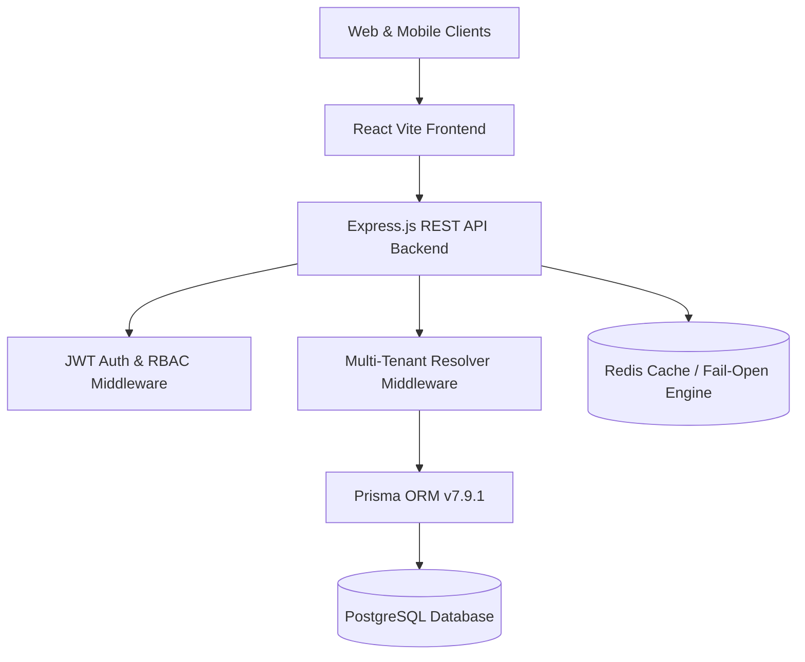
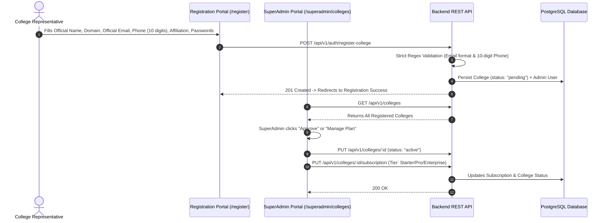
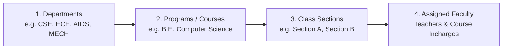
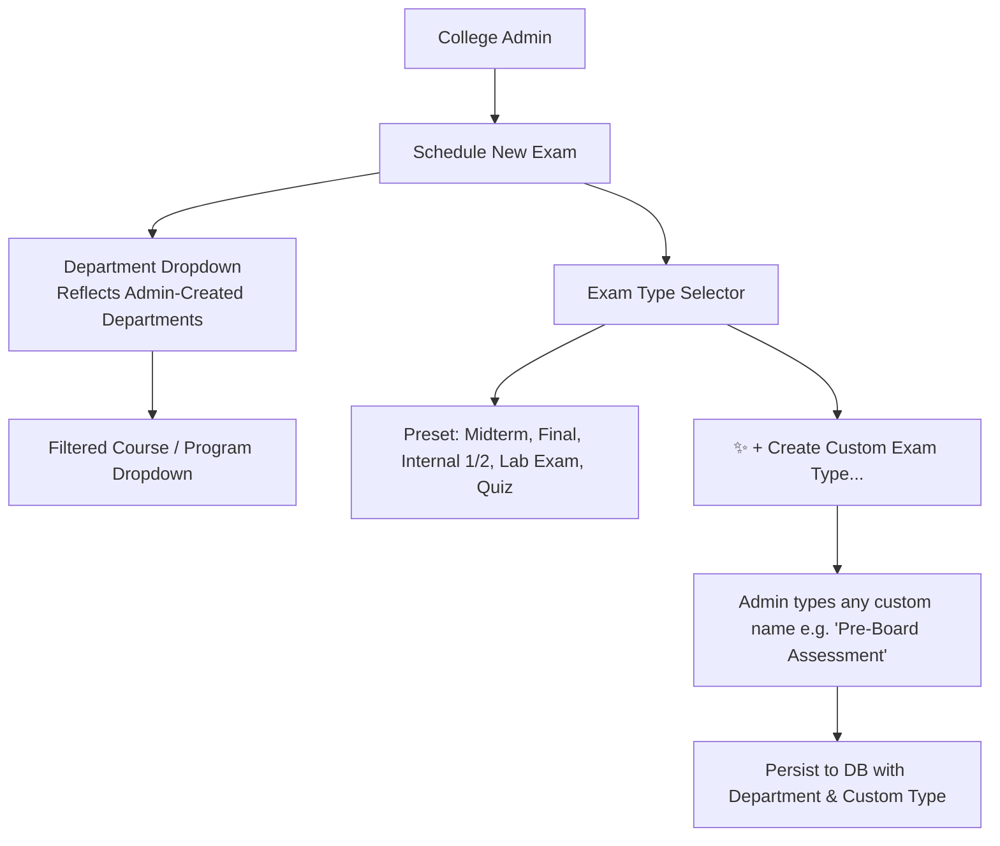
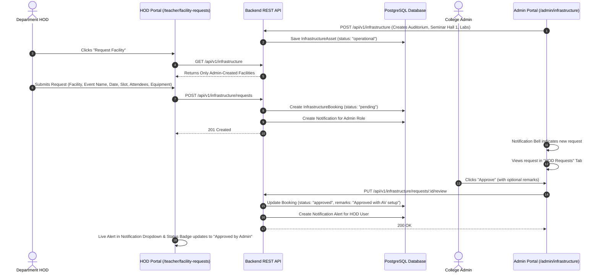

# Zuna College Management System — Comprehensive System Workflow & QA Testing Guide

> **Document Version:** 2.4.0  
> **Target Audience:** Quality Assurance (QA) & Manual Testing Team, Product Management, Development  
> **Last Updated:** August 28, 2026  
> **Environment:** Production (Railway PostgreSQL + Vercel Frontend) / Local Staging

---

## 📑 Table of Contents
1. [System Architecture & Core Stack](#1-system-architecture--core-stack)
2. [End-to-End Workflow Breakdown](#2-end-to-end-workflow-breakdown)
   - [Workflow 1: College Onboarding & Registration](#workflow-1-college-onboarding--registration)
   - [Workflow 2: Authentication & RBAC Governance](#workflow-2-authentication--rbac-governance)
   - [Workflow 3: Academic Structure Setup](#workflow-3-academic-structure-setup)
   - [Workflow 4: Timetable & Schedule Governance](#workflow-4-timetable--schedule-governance)
   - [Workflow 5: Examination Center & Custom Exam Types](#workflow-5-examination-center--custom-exam-types)
   - [Workflow 6: Infrastructure Booking & Approval Workflow](#workflow-6-infrastructure-booking--approval-workflow)
   - [Workflow 7: Student Lifecycle, Attendance & Fees](#workflow-7-student-lifecycle-attendance--fees)
   - [Workflow 8: Universal Pagination & Page Size Filter](#workflow-8-universal-pagination--page-size-filter)
3. [Summary of Latest Updates & Bug Fixes](#3-summary-of-latest-updates--bug-fixes)
4. [Step-by-Step QA Manual Test Cases](#4-step-by-step-qa-manual-test-cases)
5. [API Endpoints Reference for QA Automation](#5-api-endpoints-reference-for-qa-automation)

---

## 1. System Architecture & Core Stack

### Technology Matrix
* **Frontend:** React 19, Vite, Tailwind CSS (Product Primary Theme: Emerald `#059669` / `#10b981`), Framer Motion, Lucide Icons.
* **Backend:** Node.js 20+, Express.js, Prisma ORM, Zod Schema Validation, Sentry Error Tracing.
* **Database:** PostgreSQL (Hosted on Railway Cloud with 7 active institutional colleges).
* **Multi-Tenancy:** Automated tenant resolution via `collegeId` claims embedded in authenticated JWT tokens.

---

## 2. End-to-End Workflow Breakdown

### Workflow 1: College Onboarding & Registration

#### Key Validations Enforced:
1. **Required Asterisks (`*`):** Displayed on all mandatory input labels in `Register.jsx`.
2. **Strict Email Validation:** Validates full domain syntax `name@domain.extension` (`^[a-zA-Z0-9._%+-]+@[a-zA-Z0-9.-]+\.[a-zA-Z]{2,}$`).
3. **Phone Number Length:** Strictly 10 digits (`maxLength={10}`, input regex `/^[0-9\b]+$/`).
4. **Subscription Management:** SuperAdmin can update plan tier, pricing, student caps, and active/suspended states without affecting live Railway data.

---

### Workflow 2: Authentication & RBAC Governance

* **Roles Scoped:** `superadmin`, `admin`, `hod`, `teacher`, `student`, `parent`.
* **Access Pipeline:**
  1. `POST /api/v1/auth/login`: Authenticates credentials and returns JWT Access Token + HTTP-Only Refresh Token.
  2. `authenticate`: Verifies signature and decodes user context.
  3. `resolveTenant`: Scopes DB queries exclusively to the logged-in user's `collegeId`.
  4. `authorize(role)`: Validates role-based permission matrix.

---

### Workflow 3: Academic Structure Setup

1. **Departments (`/admin/academic-structure`):** Create institutional departments (Name + Code).
2. **Programs / Courses:** Associate courses to parent departments with semester counts and credits.
3. **Class Sections:** Define sections, capacity limits (e.g. 60 students), and assign faculty members.

---

### Workflow 4: Timetable & Schedule Governance

* **UI Redesign:** Cards feature a decoupled layout:
  * **Faculty Badge:** Circular avatar with initials + formatted title-case name (email prefix parsing removed).
  * **Venue / Room Pill:** Distinct badge preventing text wrapping or layout overlap.
  * **Product Primary Palette:** Restyled using official Emerald theme (`#006c49` / `#059669` / `#10b981`).

---

### Workflow 5: Examination Center & Custom Exam Types

#### Capabilities:
1. **Dynamic Department Reflection:** Schedule exam modal loads all departments created by the college admin.
2. **Dynamic Course Filtering:** Selecting a department automatically filters the courses belonging to that department.
3. **Custom Exam Types:** Admins can choose from preset options or select `+ Create Custom Exam Type...` to enter custom exam titles.
4. **Department Directory Filter:** Filter all exam cards and performance results by department.

---

### Workflow 6: Infrastructure Booking & Approval Workflow

---

### Workflow 7: Student Lifecycle, Attendance & Fees

1. **Student Registration & Import:** Admin can register individual students or use Bulk Excel Import (`ExcelUploadButton.jsx`).
2. **Daily Batch Attendance:** Faculty/HOD selects class and date $\rightarrow$ records Present/Absent/Late status with 1-click batch save.
3. **Fee Ledger:** Manage semester tuition fees, generate invoices, and record partial/full payments.

---

### Workflow 8: Universal Pagination & Page Size Filter

Every data table and card grid across the platform incorporates uniform pagination:
* **Default Rows Per Page:** **10 entries**.
* **Filter Options:** Dropdown with **10, 20, 50, and 100** rows per page.
* **Smart Bounds:** Automatically resets to Page 1 when changing filters or page sizes.
* **Modules Equipped:** Students, HR/Staff, Exams, Infrastructure, Courses, Departments, Sections, Notices, Superadmin Colleges.

---

## 3. Summary of Latest Updates & Bug Fixes

| Update ID | Module | Category | Description | Status |
| :--- | :--- | :--- | :--- | :--- |
| **UPD-001** | College Onboarding | Validation & UI | Added required asterisks `*` in `Register.jsx`, enforced 10-digit phone number and strict email regex. | ✅ Completed |
| **UPD-002** | Superadmin | Subscription | Connected `PUT /api/v1/colleges/:id/subscription` to allow SuperAdmin plan management. | ✅ Completed |
| **UPD-003** | Database | Multi-Tenant Data | Connected local environment to Railway live PostgreSQL URL to access all 7 institutional colleges. | ✅ Completed |
| **UPD-004** | Timetable | UX / UI Redesign | Redesigned schedule cards with decoupled faculty avatar, formatted name, room badge, and primary color theme. | ✅ Completed |
| **UPD-005** | Exams | Dynamic Integration | Linked `useDepartments()` to schedule modal and exam directory; fixed `collegeId` vs `departmentId` parameter issue. | ✅ Completed |
| **UPD-006** | Exams | Customization | Enabled custom user-defined exam types in modal and backend schema. | ✅ Completed |
| **UPD-007** | Infrastructure | Workflow | Built full HOD facility request and Admin approval workflow with DB models `InfrastructureBooking` & `Notification`. | ✅ Completed |
| **UPD-008** | Notifications | Real-Time Alerts | Created `/api/v1/notifications` REST API and updated `NotificationDropdown.jsx` with unread badges and alerts. | ✅ Completed |
| **UPD-009** | Core UI | Universal Pagination | Created `Pagination.jsx` and integrated 10-row default with 10/20/50/100 filter across all modules. | ✅ Completed |

---

## 4. Step-by-Step QA Manual Test Cases

### Test Suite 1: College Registration & Validation
* **TC-REG-01 (Mandatory Asterisks):** Open `/register`. Verify all mandatory input fields (College Name, Email, Phone, Passwords) display a red `*` asterisk.
* **TC-REG-02 (Email Validation):** Enter `test@` or `test@gmail`. Verify validation blocks submission until a valid domain like `admin@college.edu` is provided.
* **TC-REG-03 (Phone Number 10 Digits):** Enter 9 or 11 digits in `officialPhone`. Verify input blocks exceeding 10 digits and enforces numeric characters only.

### Test Suite 2: Timetable UX & Theme
* **TC-TIME-01 (Card Layout):** Navigate to `/admin/timetable`. Verify faculty names are formatted in title case and venue badges do not overlap or wrap into multiple lines.
* **TC-TIME-02 (Primary Colors):** Verify action buttons and headers use the emerald product primary color palette.

### Test Suite 3: Exams & Department Dynamic Reflection
* **TC-EXAM-01 (Department Dropdown):** Navigate to `/admin/exams` and click **Schedule Exam**. Verify the **Department \*** dropdown lists all departments created by the admin.
* **TC-EXAM-02 (Course Filter):** Select a department. Verify the **Course / Program** dropdown filters to show only courses belonging to that department.
* **TC-EXAM-03 (Custom Exam Type):** In the **Exam Type** dropdown, select `✨ + Create Custom Exam Type...`. Verify a text input appears. Enter `Pre-Board Assessment 1` and save. Verify the exam is created with the custom type.

### Test Suite 4: Infrastructure HOD Request & Approval Workflow
* **TC-INFRA-01 (Admin Facility Registry):** As Admin (`/admin/infrastructure`), click **Add Facility**. Create `Main Auditorium` (Capacity: 500, Central Block). Verify it appears in the grid.
* **TC-INFRA-02 (HOD Facility Request):** Log in as an HOD/Teacher and navigate to `/teacher/facility-requests`. Click **Request Facility**. Verify `Main Auditorium` appears in the dropdown. Fill details and submit.
* **TC-INFRA-03 (Admin Notification & Review):** Log in as Admin. Verify the notification bell shows an unread badge with the request. Open `/admin/infrastructure` $\rightarrow$ **HOD Requests** tab. Click **Approve** and add remarks *"Approved with AV setup"*.
* **TC-INFRA-04 (HOD Alert Verification):** In the HOD portal, verify an approval notification alert is received and the request status changes to **Approved by Admin** with the admin's remarks.

### Test Suite 5: Universal Pagination & Page Size Filter
* **TC-PAGE-01 (Default 10 Rows):** Navigate to `/admin/students` or `/admin/exams`. Verify by default exactly 10 rows/cards are rendered per page.
* **TC-PAGE-02 (Page Size Filter):** Change the page size dropdown from `10` to `20`, `50`, or `100`. Verify the table expands to display the requested rows.
* **TC-PAGE-03 (Pagination Controls):** Verify Next, Previous, and numbered page buttons accurately navigate through records and update the entry counter (e.g. `Showing 1 to 10 of 45 entries`).

---

## 5. API Endpoints Reference for QA Automation

### Infrastructure & Facility Bookings
| Method | Endpoint | Auth Required | Description |
| :--- | :--- | :--- | :--- |
| `GET` | `/api/v1/infrastructure` | Yes | List all admin-created facilities in the college |
| `POST` | `/api/v1/infrastructure` | Admin Only | Register a new facility asset |
| `PUT` | `/api/v1/infrastructure/:id` | Admin Only | Update facility details |
| `DELETE` | `/api/v1/infrastructure/:id` | Admin Only | Remove facility from registry |
| `GET` | `/api/v1/infrastructure/requests` | Yes | Get facility booking requests (scoped to user/admin) |
| `POST` | `/api/v1/infrastructure/requests` | Yes | Submit a new facility permission request |
| `PUT` | `/api/v1/infrastructure/requests/:id/review` | Admin Only | Approve or reject a booking request with remarks |

### In-App Notifications
| Method | Endpoint | Auth Required | Description |
| :--- | :--- | :--- | :--- |
| `GET` | `/api/v1/notifications` | Yes | Fetch recent in-app notifications for user/role |
| `PUT` | `/api/v1/notifications/:id/read` | Yes | Mark a notification as read |
| `PUT` | `/api/v1/notifications/read-all` | Yes | Mark all user notifications as read |

### Examinations
| Method | Endpoint | Auth Required | Description |
| :--- | :--- | :--- | :--- |
| `GET` | `/api/v1/exams` | Yes | List exams with associated department and course info |
| `POST` | `/api/v1/exams` | Admin / Faculty | Create exam schedule with departmentId and custom type |
| `PUT` | `/api/v1/exams/:id` | Admin / Faculty | Update exam schedule |
| `DELETE` | `/api/v1/exams/:id` | Admin Only | Cancel and delete an exam schedule |

---

*Document compiled and ready for PDF export and distribution to QA testing teams.*
